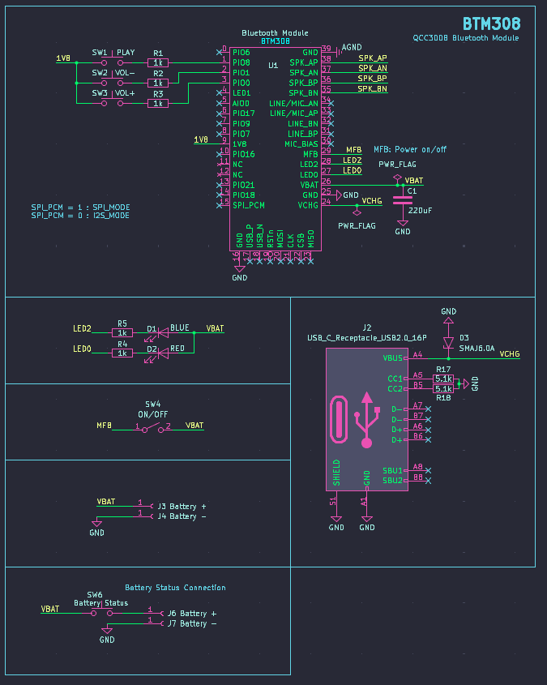
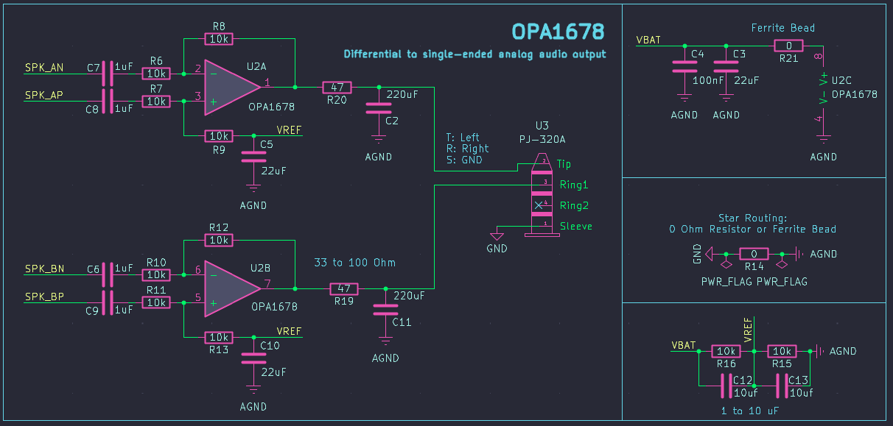
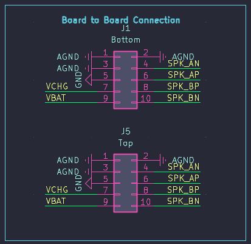
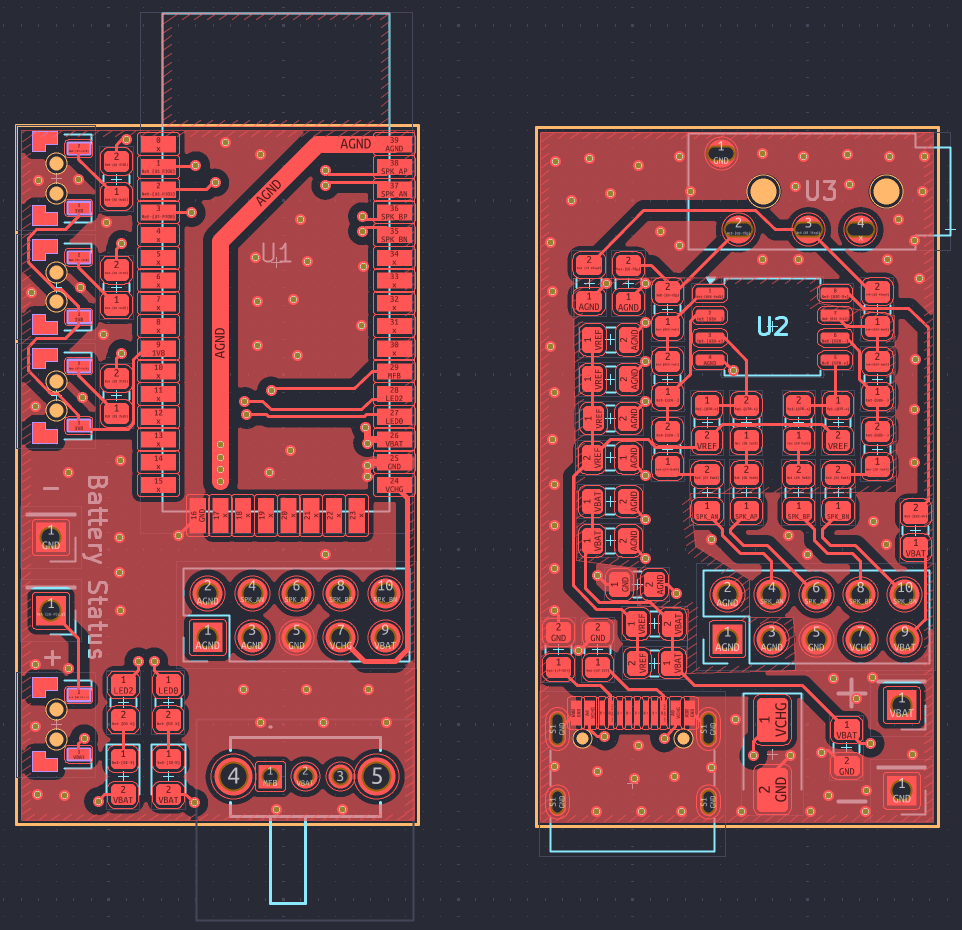
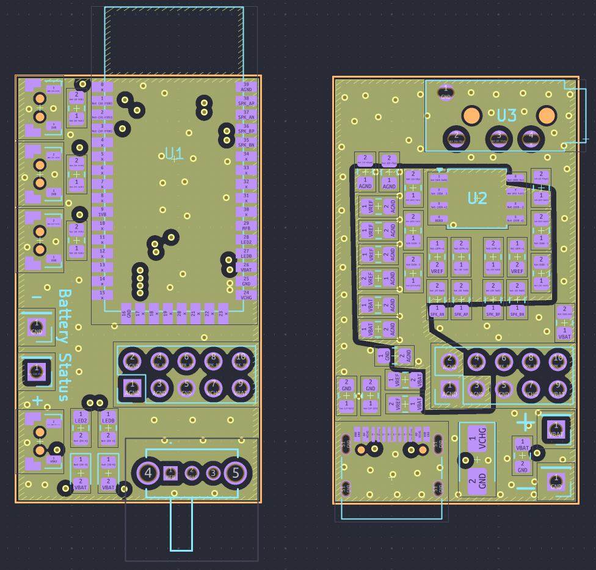
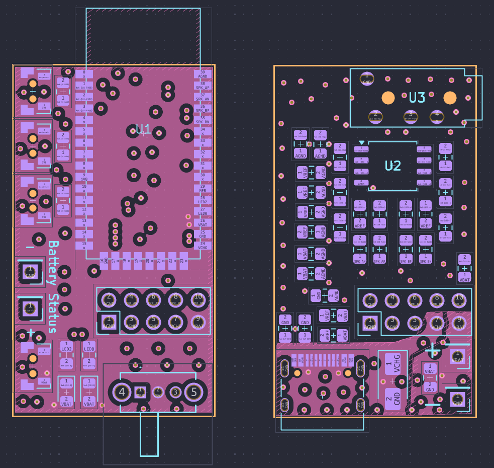
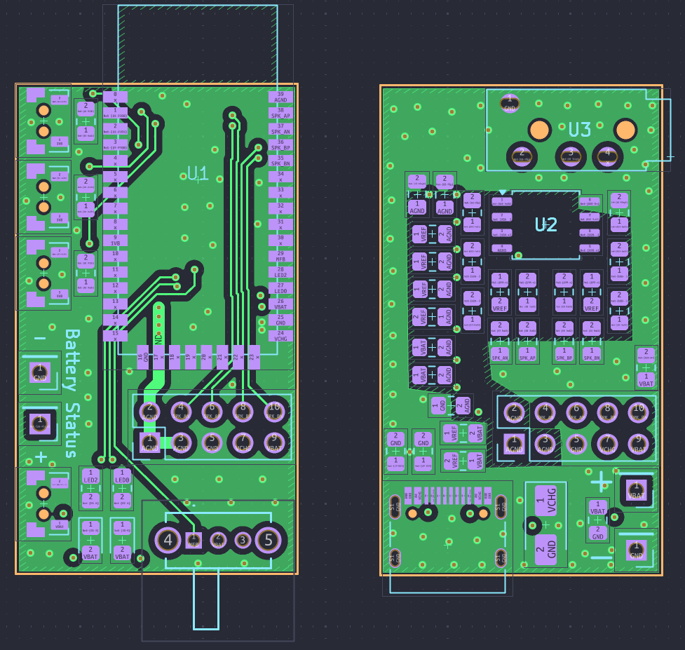
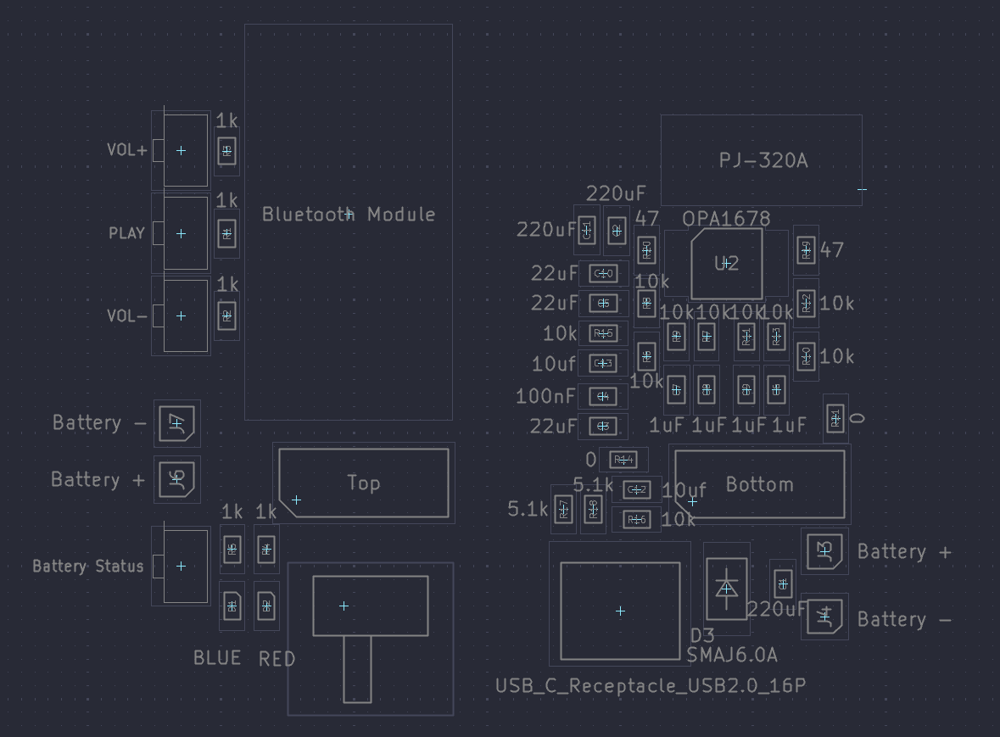

#  Host Board for BTM308 Bluetooth Audio Receiver

This is a carrier board for the BTM308 Bluetooth audio module.

## Schematic

### BTM308

### Differential OP-AMP (OPA1678)

### Board to Board Interface

## Layout

| Top | Inner 1 | Inner 2 | Bottom |
|---|---|---|---|
|  |   |  |  |

## Assembly

## Bill of Materials

| Designator		| Footprint								| Qty. 	| Designation		|
| --- 				| --- 									| ---	| --- 				|
| C4				| C_0805_2012Metric						| 1		| 100nF				|
| C8,C6,C7,C9		| C_0805_2012Metric						| 4		| 1uF				|
| C12,C13			| C_0805_2012Metric						| 2		| 10uf				|
| C5,C3,C10			| C_0805_2012Metric						| 3		| 22uF				|
| C11,C1,C2			| C_0805_2012Metric						| 3		| 220uF				|
| D1				| LED_0805_2012Metric					| 1		| BLUE				|
| D2				| LED_0805_2012Metric					| 1		| RED				|
| D3				| D_SMA									| 1		| SMAJ6.0A			|
| J1				| PinHeader_2x05_P2.54mm_Vertical		| 1		| Bottom			|
| J5				| PinHeader_2x05_P2.54mm_Vertical		| 1		| Top				|
| J2				| USB_C_Receptacle_HRO_TYPE-C-31-M-12	| 1		| USB_C_Receptacle_USB2.0_16P |
| R14,R21			| R_0805_2012Metric						| 2		| 0R / Ferrite Bead	|
| R2,R5,R1,R4,R3	| R_0805_2012Metric 					| 5		| 1k				|
| R17,R18			| R_0805_2012Metric 					| 2		| 5.1k				|
| R16,R9,R6,R7,R13,R10,R11,R15,R8,R12 | R_0805_2012Metric 	| 10	| 10k				|
| R20,R19			| R_0805_2012Metric 					| 2		| 47				|
| SW6,SW1,SW2,SW3	| TST-A002_0.6MM_BOSS					| 4		| Battery Status, PLAY, VOL+/-	|
| SW4				| SLW8645745ARAND						| 1		| ON/OFF			|
| U1				| BTM308								| 1		| Bluetooth Module	|
| U2				| SOIC-8_5.3x5.3mm_P1.27mm				| 1		| OPA1678 OP-AMP    |
| U3				| PJ-320A								| 1		| PJ-320A Audio     |

